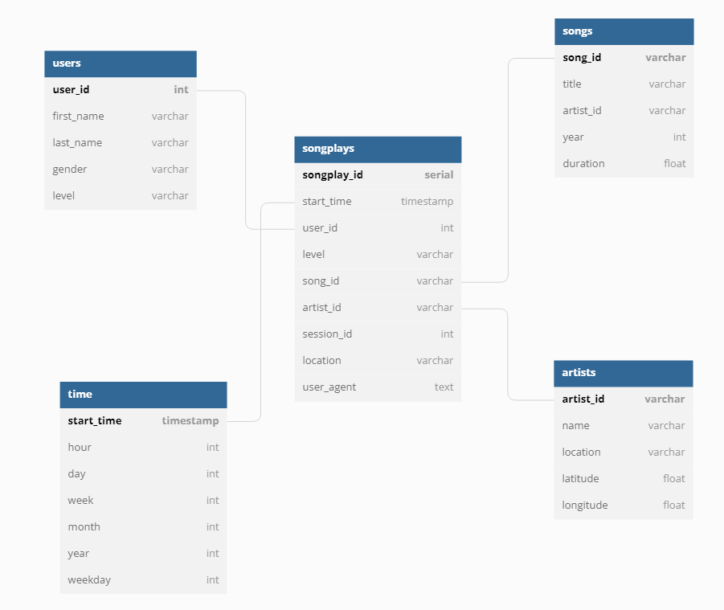

## Datasets

### Song dataset
- **Path**: 's3://udacity-dend/song_data'

- **Description**  
The first dataset is a subset of real data from the Million Song Dataset. Each file is in JSON format and contains metadata about a song and the artist of that song. The files are partitioned by the first three letters of each song's track ID. For example, here are file paths to two files in this dataset.

```
song_data/A/B/C/TRABCEI128F424C983.json  
song_data/A/A/B/TRAABJL12903CDCF1A.json
```

And below is an example of what a single song file, TRAABJL12903CDCF1A.json, looks like.
```
{"num_songs": 1, "artist_id": "ARJIE2Y1187B994AB7", "artist_latitude": null, "artist_longitude": null, "artist_location": "", "artist_name": "Line Renaud", "song_id": "SOUPIRU12A6D4FA1E1", "title": "Der Kleine Dompfaff", "duration": 152.92036, "year": 0}
```
### Log dataset
- **Path**: 's3://udacity-dend/log_data'

- **Description**  
The second dataset consists of log files in JSON format generated by this event simulator based on the songs in the dataset above. These simulate app activity logs from an imaginary music streaming app based on configuration settings. The log files in the dataset you'll be working with are partitioned by year and month. For example, here are file paths to two files in this dataset.
```
log_data/2018/11/2018-11-12-events.json  
log_data/2018/11/2018-11-13-events.json
```
And below is an example of what the data in a log file, 2018-11-12-events.json, looks like.
<center>
  
</center>

## PURPOSE OF THE DATABASE

The startup, Sparkify wants to extract datasets from udacity bucket and store it their own bucket using emr cluster. They need to build ETL pipeline to extract data and transform it into a star schema. Lastly, they store the data schema into parquet file form.

## Descriptions of each template

### `dl.cfg`
Informations for accessing AWS S3(Datalake)

### `etl.py`
Execute ETL pipeline and Data modeling with Apache Spark
  1. Create spark session
  2. Extract datasets from datalake
  3. Execute ETL pipline and model the data
  
## STEPS FOR PROJECT
1. Create iam user with access role
2. Complete `dl.cfg` file based on the iam user's information
3. Write the path of datasets
4. Make pipelines for each table and run `etl.py`
5. Get output path for storing parquet files

## DATABASE SCHEMA DESIGN

<center>
  
</center>
